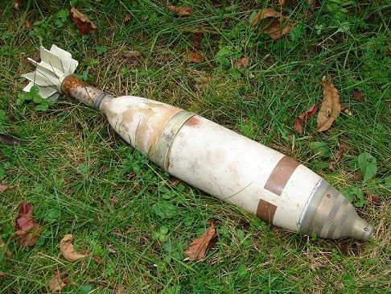

GESTIÓN DE UXO EN CAMPOS DE MANIOBRAS.

**alias AGNEX**

1.  En el CNMTSG, se encuentran diversos artefactos sin explosionar (UXO) o
    caídas fuera de las zonas de tiro, el control actualmente se lleva mediante
    un fichero de Excel.

2.  Se necesita un sistema que permita llevar el control de los artefactos sin
    explosionar (UXO) que se encuentran en el Campo Nacional de Maniobras y Tiro
    de San Gregorio (CNMTSG).

3.  El sistema debe permitir dar de alta nuevos artefactos encontrados,
    incorporando a él además de la información del mismo, las fotos que se hagan
    para aumentar todo lo posible su posterior localización para su retirada.

4.  El sistema deber permitir cargar la cartografía de la zona del CNMTSG.

El control de acceso se llevará a cabo mediante un login de usuario que tendrá
asociado un perfil. Habrá usuarios con perfil tipo administrador y usuarios de
solo consulta para poder visualizar el mapa de la zona con los artefactos.

1.  El sistema proporcionará un mapa de situación con los artefactos,
    permitiendo hacer zoom sobre una zona determinada.

2.  El sistema podrá realizar un listado de batidas, es decir, se podrán ir
    seleccionando diferentes artefactos de una zona para posteriormente obtener
    un listado que servirá para que el personal de recuperación de los
    artefactos tenga toda la información necesaria.

3.  El sistema deberá poder permitir que se cambie el estado de un artefacto que
    ya ha sido desactivado o retirado.

4.  Del sistema se podrá obtener listados de los artefactos por estado, fecha,
    etc.

5.  Se podrán localizar y poner sobre el plano digital todos los NOEX pendientes
    de explosionar: Desplegable con foto, calibre y tipo de especialista a
    actuar para su neutralización (TDM o EOD).

6.  Se mantendrá un histórico de NOEX explosionados para mejorar las zonas de
    rastrilleo y limpieza de cortafuegos. (foto, profundidad del noex, estado…).
    Requisito solicitado por DIVOPE.

7.  Permitirá la gestión de capas de información dibujadas sobre la cartografía:

    -   **Líneas**: líneas de seguridad del campo. En particular las de Boyero
        (sectores de tiro y líneas de seguridad) y F-23 (línea papa). Baudín,
        situar las zonas de seguridad en función de la carga a explosionar.

    -   **Zonas**: zonas de caída de proyecties (ZCP): cuadro emergente
        indicando el tipo de armas que se puede usar y las direcciones de tiro
        permitidas en cada zona.

    -   **Instalaciones a disposición de Instrucción y Adiestramiento (I/A)** :
        cuadro emergente con una breve descripción de las mismas incluyendo
        fotos y texto libre.

    -   **Zonas de obras**. Situación de las obras que se  estén realizando en
        el campo con desplegable con foto, presupuesto, empresa, fecha de
        entrega…

    -   **Zonas de Vivac Autorizadas**: cuadro emergente con descripción de las
        mismas con datos de capacidades y fotografías.

    -   **Entradas al ACMT**, desplegable con foto de su estado y accesos
        próximos.

    -   **Zona de Lanzamiento paracaidista (DZ)** usada por el EA con sus ejes
        de pasada.

    -   **Itinerarios diversos**: Plasmar, además de los itinerarios
        contraincendios y evacuación de Alfocea (estado y evolución), aquellos
         otros itinerarios de frecuente uso, pero que hayan podido quedar
        impracticables y peligrosos hasta su reparación, (p. ej. por acción de
        la meteorología como grandes arrastres de tierras, grietas y derrumbes
        del terreno, etc. ).

    -   **Zonas de localización de intrusos** y tipo de intrusismo (cazadores,
        seteros, paseantes, ciclistas, chatarreros…).

    -   **Zonas de rotura o acceso no permitido** a lo largo del vallado con
        desplegable sobre tipo de valla, estado, longitud del agujero, fecha de
        solicitud de reparación…en su caso.

    -   **Puntos de aguada contraincendios**. Balsetes habilitados, depósitos
        flexibles, tomas de red de suministro….

    -   **Situación de antenas** en el campo con sus capacidades (radioenlace,
        láser, grupo electrógeno, placa solar  operatividad…).
